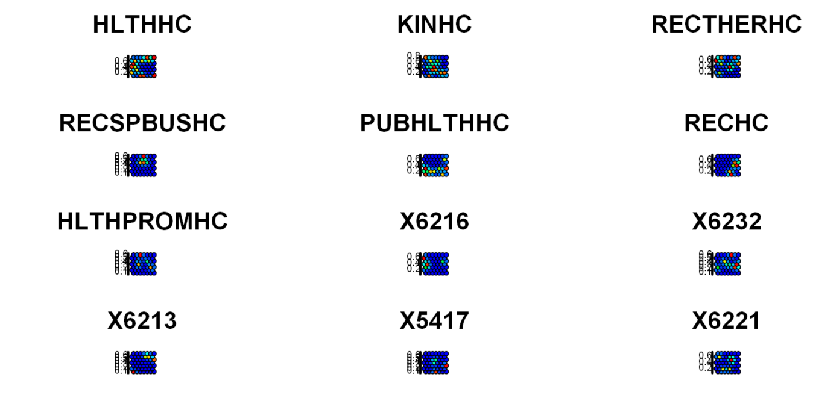
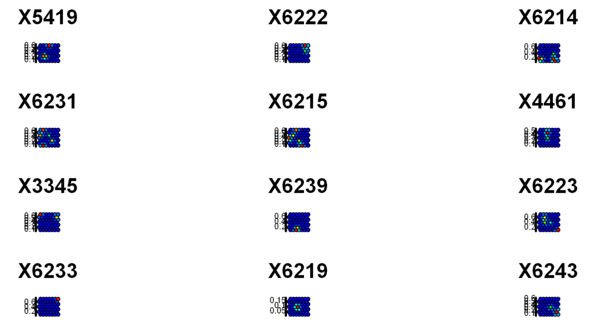
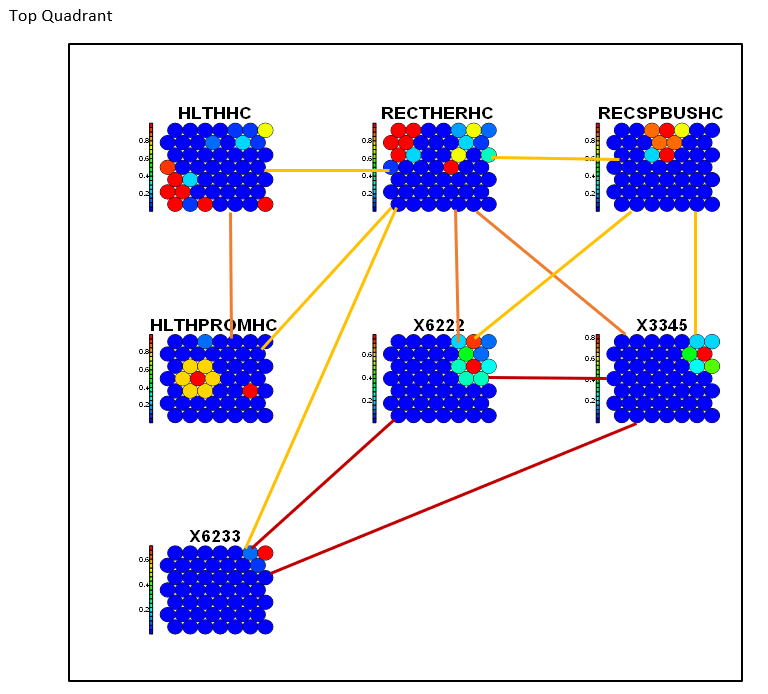
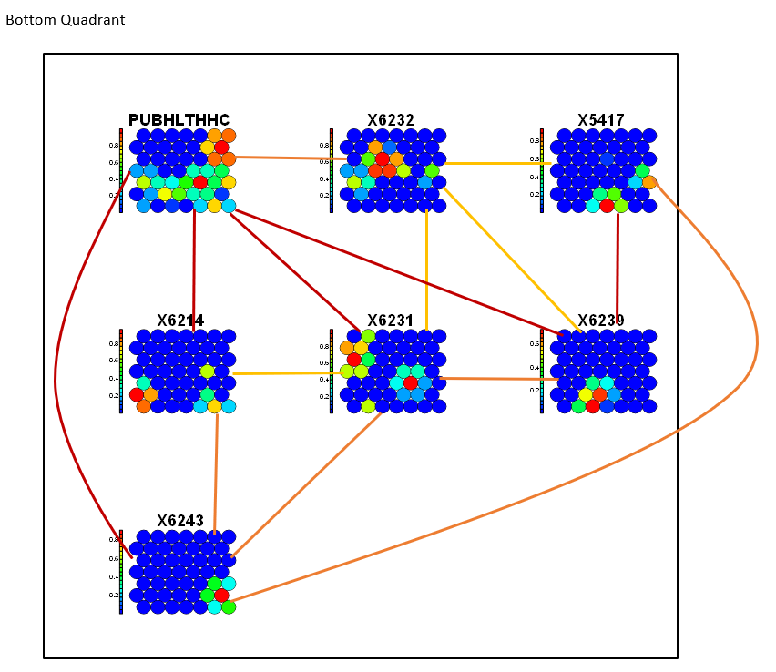
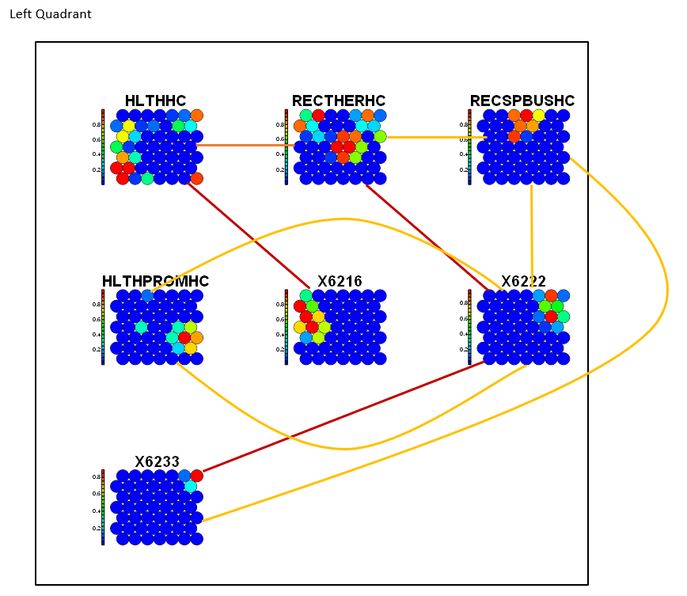
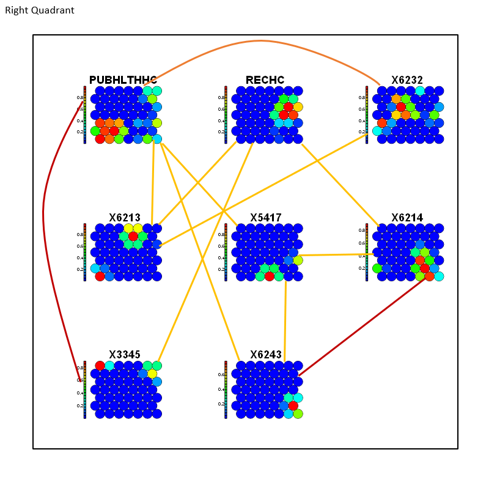

# Self-Organizing-Maps
A sample SOM created for personal use.
The SOM illustrates applied health science program correlations to industries.

**Goal**: To find the relation between programs and industries and help focus job development for programs to their related industries. 

#### Industries Used

6216 Home Health Care Services  
6232 Residential Developmental Handicap, Mental Health and Substance Abuse Facilities  
6213 Offices of Other Health Practitioners  
5417 Scientific Research and Development Services  
6221 General Medical and Surgical Hospitals  
5419 Other Professional, Scientific and Technical Services  
6222 Psychiatric and Substance Abuse Hospitals  
6214 Out Patient Care Centres  
6231 Nursing Care Facilities  
6215 Medical and Diagnostic Laboratories  
4461 Health and Personal Care Stores  
3345 Navigational, Measuring, Medical and Control Instruments Manufacturing  
6239 Other Residential Care Facilities  
6223 Specialty (except Psychiatric and Substance Abuse) Hospitals  
6233 Community Care Facilities for the Elderly  
6219 Other Ambulatory Health Care Services  
6243 Vocational Rehabilitation Services  

#### AHS Co-op Programs

HLTHHC - Health Studies   
KINHC - Kinesiology   
RECHC - Recreation and Leisure   
RECTHERHC - Recreation and Leisure -- Therapeutic Recreation option   
RECSPBUSHC - Recreation and Leisure -- Recreation and Sport Business option   
PUBHLTHHC - Public Health    
HLTHPROMHC - Health Studies -- Health Promotion option   

## Full Self Organizing Map

An better analysis is done by grouping the graphs based on the location of their cluster. 
For example, two graphs that have cluster in the top quadrant of the graph are grouped together. 
After grouping them based off quadrants, another SOM algorithm is conducted to increase the quality of prediction of the algorithm.

The lines represent the strength of the correlation between each industry and program. The correlations are based off proximity and overlapping of clusters. 

#### Initial SOM Clusters

#### Top Quadrant

#### Bottom Quadrant

#### Left Quadrant

#### Right Quadrant

## Citations
*Ahmad, A., & Yusof, R. (2016). A Modified Kohonen Self-Organizing Map (Ksom) Clustering For Four Categorical Data. Jurnal Teknologi, 78(6-13). doi:10.11113/jt.v78.9275*

## Authors
Jaskaran Ghotra and Stephen Zhao